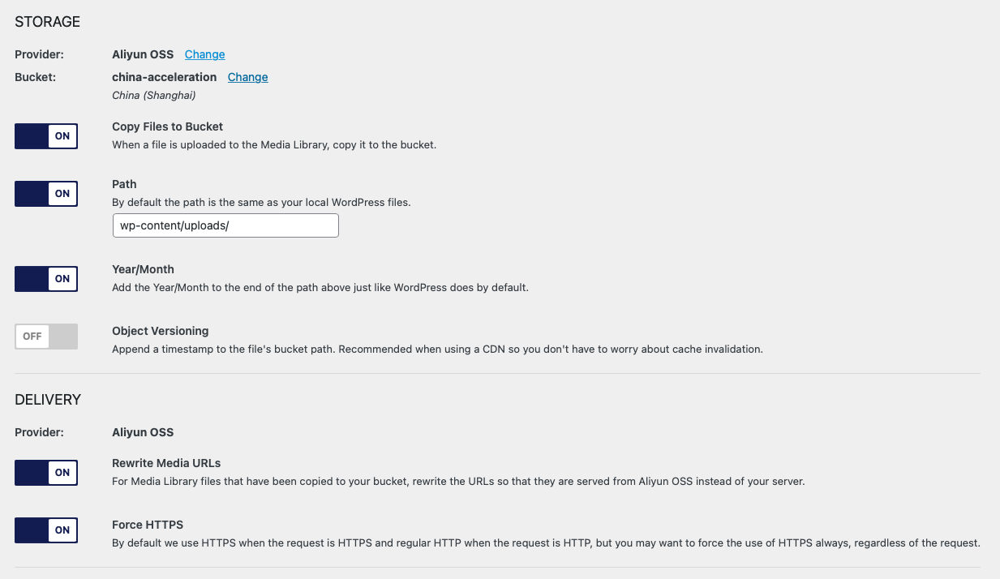

# Aliyun OSS for WP Media
WordPress plugin which uses Aliyun OSS to offload media.

## How to use it
The preffered way to use this plugin is to store the keys in your `functions.php` file like:
```php
define('ACOSSM_SETTINGS', serialize([
    'provider' => 'aliyun',
    'access-key-id' => '***************',
    'secret-access-key' => '***************',
]));
```
Just replace the `***************` fields with the actual credentials.

From here, the plugin will ask for an existing bucket to use for this. Select the region and set the bucket name and that should be it.

The recommended configuration for the plugin in most of cases is:
